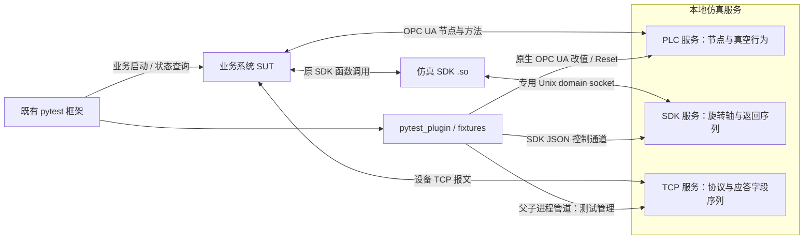

# SimulatorX 本地仿真框架 PRD

本文定义整机、子系统、硬件的组织方式，以及真空 PLC、旋转轴 SDK 和参考 TCP 接口的需求与实现基线，供开发、测试及接入项目共同使用。快速运行步骤见 [README](../README.md)。

阅读导航：[总体架构](#architecture) · [PLC](#plc) · [SDK](#sdk) · [TCP](#tcp) · [序列规则](#sequences) · [pytest 接入](#pytest) · [运行配置](#running) · [验收](#validation) · [适配边界](#adapters) · [接口附录](#abi)

<a id="goals"></a>

## 1. 目标与交付边界

通过本地软件服务提供可控的设备状态、运动行为和协议应答，帮助既有自动化框架验证业务系统的正常流程及异常处理。SUT 指被测业务系统，其业务操作、报警与恢复判定、进程生命周期由接入项目负责。

仓库提供独立的 [SUT 接入示例项目](../examples/sut_integration/README.md)，位于 `examples/sut_integration/`。其中参考 SUT、业务用例和生命周期适配均属于外部接入示例，不属于仿真框架源码、公共 API 或运行依赖；框架不导入、启动或自动发现 SUT。示例验收与框架回归分别运行和报告。

| 子系统 / 硬件 | 当前交付 | 主要控制方式 |
|---|---|---|
| vacuum / chamber_plc | 单真空腔室、八个 OPC UA 原生可写节点、基础真空行为和 Reset | 原生写值、质量码、时间戳与方法调用 |
| motion / rotary_axis | 单个有限行程旋转轴、参考 Linux `.so`、函数返回值序列及模型故障 | 专用 IPC 调用；测试控制接口配置返回值、卡住和限位 |
| detector / modbus_tcp | 独立请求应答服务、示例协议、应答字段序列 | 按完整请求选择字段，由协议编码器生成应答 |
| pytest 接入 | device_service / device、层级硬件句柄、逐用例诊断和清理 | 按配置和显式子集管理生命周期 |

运行与测试使用 **Python 3.9.12（64 位）**，运行依赖 `opcua==0.98.13`，测试基线 `pytest==8.4.2`；完整依赖见 [requirements.lock](../requirements.lock)。框架从 `src` 源码运行。完整 SDK 服务与 `.so` 验证在 Linux／WSL 中进行；TCP 和纯运动模型也可在 Windows 运行。

参考配置每个硬件各一个实例，支持配置多个独立实例；测试串行执行。TCP／OPC UA 监听 `127.0.0.1`，SDK 使用本地 Unix domain socket。并行 CI 作业应各自运行独立实例。当前交付验证了参考 SDK ABI 和示例 TCP 协议，真实厂商适配条件见[第 10 节](#adapters)。

<a id="architecture"></a>

## 2. 总体架构与职责



三类服务分别维护模型、序列、连接和生命周期。测试可以同时使用它们，Reset 或停止任意一个不影响另外两个；当前没有三类设备共享的物理状态模型。

业务用例先通过仿真接口准备环境，再调用 SUT 执行业务。SUT 按真实设备协议操作并读取或同步当前状态，用例通过 SUT 提供的查询/状态接口限时等待并断言结果。读取 SimulatorX 状态用于准备、健康检查和诊断，不作为 SUT 业务通过的依据。框架自身测试以 SimulatorX 为被测对象，仍可直接断言仿真状态。

SDK 的 `.so` 在业务进程内负责接口适配，外部 SDK 服务负责行为计算。SDK 服务提供两个不同的 Unix socket：`sdk_socket` 接收 `.so` 的二进制调用，`control_socket` 接收测试侧 JSON 配置与查询。TCP 服务仅监听设备业务端口；Reset、响应序列、健康检查和诊断通过父子进程标准输入／输出管道传递，不额外监听控制端口，其业务应答不经过 SDK 服务。

PLC 节点保存唯一业务状态，每轮行为从当前节点值推进，原生请求、行为更新与 Reset 由同一锁同步。SDK 命令、查询和时间更新在同一状态锁内同步；TCP 按完整请求原子选择应答字段。公共代码提供配置加载、生命周期编排、通信、序列和进程辅助能力，各硬件的状态实例互不共享。三个协议宿主复用 ServiceHardware 和统一子进程入口；PLC/SDK 共用 PeriodicLoop。三协议由子系统 ID 与硬件 ID 固定定位 model.py:create，宿主不导入真空、旋转轴或参考 TCP 设备。

<a id="plc"></a>

## 3. PLC 节点与真空行为

### 3.1 节点契约

Namespace URI 为 `urn:simulatorx:mvp:vacuum`，对象路径为 `Objects/SimulatorX/VacuumChamber1`。客户端按 URI 查询实际命名空间索引，不依赖固定的 `ns` 数字。

| 逻辑节点 | OPC UA 类型 | Reset 初值 | 定义 |
|---|---|---|---|
| `vacuum.valve_command` | UInt16 | 0 | 0 无命令、1 开阀、2 关阀 |
| `vacuum.valve_open` | Boolean | false | 破真空阀反馈 |
| `vacuum.valve_result` | UInt16 | 0 | 0 空闲、1 执行中、2 成功、3 失败 |
| `vacuum.command` | UInt16 | 0 | 0 无命令、1 抽真空、2 破真空、3 停止并关阀 |
| `vacuum.pressure_pa` | Double | 101325 | 当前压力，单位 Pa |
| `vacuum.state_code` | UInt16 | 0 | 0 空闲、1 抽气、2 破真空、3 真空达标、4 故障 |
| `vacuum.result_code` | UInt16 | 0 | 真空操作结果，编码同 `valve_result` |
| `vacuum.alarm_code` | UInt16 | 0 | 0 无报警、1 抽气与开阀冲突、2 非法命令 |

八个变量均为可读写标量。[NodeSet XML](../src/subsystems/vacuum/chamber_plc/resources/vacuum.xml) 定义节点层级、类型、权限和导入初值；[bindings.json](../src/subsystems/vacuum/chamber_plc/resources/bindings.json) 定义逻辑映射、校验信息与 Reset 基线。二者需人工同步，单独修改 JSON 不会创建节点；启动和 Reset 最终采用绑定的 `baseline`。

### 3.2 基础行为

| 动作或条件 | 阀门反馈与结果 | 真空状态、结果与报警 |
|---|---|---|
| 开阀或关阀 | 反馈对应变化，结果 1 → 2 | 独立操作不改真空结果；抽气中开阀触发联锁 |
| 阀门命令非法 | 反馈保持，阀门结果 3 | 报警 2 |
| 关阀时抽真空 | 阀门保持 | 状态 1、结果 1、报警 0 |
| 开阀时请求抽气或抽气中开阀 | 阀门可执行成功 | 状态 4、结果 3、报警 1 |
| 破真空 | 先退出抽气再开阀 | 状态 2、结果 1、报警 0 |
| 抽气达标 | 保持关闭 | 状态 3、结果 2 |
| 破真空达到常压 | 保持打开 | 状态 0、结果 2 |
| 停止并关阀 | 关闭、阀门结果 2 | 状态 0、结果 0，报警保持 |
| 真空命令非法 | 反馈保持 | 状态 4、结果 3、报警 2 |

处理命令后归零，确认归零后可重复提交；归零前的新写入可能替换尚未处理的命令。阀门立即反馈，客户端可能看不到短暂的执行中状态。有效抽气／破真空命令和 Reset 清除报警。

默认每 100 ms 按经过的时间计算压力：

```text
P_next = P_current × exp(-dt / tau) + P_target × (1 - exp(-dt / tau))
```

开阀趋向 101325 Pa，关阀抽气趋向 1000 Pa；其他状态保持压力，完成容差为 20 Pa。参考腔室抽气／破真空时间常数固定为 0.2 s／0.15 s。`pump_tau`、`vent_tau`、`target_pressure`、`tolerance`、`tick_interval` 在该设备代码的 `PARAMETERS` 中维护，不提供外部业务参数配置。

自动行为持续运行，下一轮从测试写入后的当前压力继续计算。压力质量非 Good、值为 Null、NaN 或无穷时跳过压力计算并保留 DataValue，同时继续处理命令与 Reset；无可计算压力时不能判定完成。状态、结果与报警随业务动作或转换更新，静态节点不要求持续刷新时间戳。

### 3.3 原生故障注入与 Reset

使用 `opcua.Node.set_value(value, VariantType)` 写值，或传入 `ua.DataValue` 写质量码和源／服务器时间戳。UInt16 接受 0–65535，Double 接受负值和非有限值，Null Variant 表示空值。错误类型返回 `BadTypeMismatch` 并保留原节点值。

`get_value()`／`get_data_value()` 遇到 Bad 质量会抛异常；检查完整异常 DataValue 时使用 `get_attributes([Value])` 或原生 Read 请求。PLC 不使用 SDK/TCP 的返回序列机制，持续异常由测试按场景重复写入。多次请求按实际时序生效，不承诺跨请求的多节点事务或持续覆盖。

`VacuumChamber1.Reset` 是同一命名空间的原生方法，无输入，成功返回 Boolean true。它恢复绑定基线、Good 质量、源／服务器时间戳及运行计时，同时保留连接和订阅。Reset 前需停止业务系统和后台写入者；方法不会阻止其他客户端随后再次改值。恢复失败后环境不可复用，需要重启。

节点写入成功只表示条件已设置。异常值本身不会自动完成业务系统的异常判定，测试仍需调用并观察 SUT 的报警、流程或恢复结果。

<a id="sdk"></a>

## 4. SDK 旋转轴行为与故障控制

### 4.1 模型参数与时间推进

参考 SDK 仅包含轴号 `1`，使用角度、角速度和角加速度，配置有限上下界，不进行 360° 取模或最短路径选择。

| 配置项 | 默认值 | 单位 |
|---|---|---|
| `minimum` / `maximum` | -180 / 180 | ° |
| `initial` / `home` | 0 / 0 | ° |
| `max_speed` | 90 | °/s |
| `acceleration` / `deceleration` | 180 / 180 | °/s² |
| `tick_interval` | 0.01 | s |

设备内部校验参数的有限数值、合法行程、初始／回零位置及正速度、加减速度和更新周期。运动使用梯形速度轨迹，短行程使用三角形轨迹；服务按统一单调时间在后台更新，查询频率不决定运动进度。

上述参数是参考设备代码中的固定值，修改需在本设备代码中完成并验证。更新周期不是硬实时保证，模型不承诺真实轴的伺服动态、摩擦、回差或定位误差。

### 4.2 正常运动与完成反馈

| 操作或条件 | 行为 |
|---|---|
| 初始化／测试 Reset | 初始角度，未使能、未回零，`busy=false`、`done=false` |
| Enable | 在未触发限位且无锁存报警时使能 |
| Home | 使能后允许回零；完成后设置 `homed=true` |
| MoveAbsolute / MoveRelative | 回零后允许绝对／相对定位；速度必须在允许范围内 |
| 命令返回成功 | 表示命令已接受，运动异步推进；只有到位且速度归零才报告 `done=true` |
| 零距离运动 | 可以立即完成 |
| 忙碌期间的新定位／回零 | 拒绝新命令，保留已有运动 |
| 越界目标 | 直接拒绝，不启动运动；合法运动不越过配置行程 |
| 运动中的 Stop | 以配置减速度停止并取消原目标，完成后 `busy=false`、`done=false`；零速度时直接取消 |
| 空闲时的 Stop | 成功返回，保留已有空闲状态及完成标志 |
| Disable | 立即结束运动、清除使能和回零状态；不清除已注入故障或锁存报警 |

### 4.3 模型故障与恢复

| 故障／操作 | 注入后行为 | 恢复规则 |
|---|---|---|
| `stalled=true` | 定位／回零时冻结当前位置、速度归零，保留目标和 `busy` | 撤销后从当前位置重新规划，不补走冻结期间位移；Stop 可取消目标 |
| 停止过程遇到卡住 | 取消停止目标并结束忙碌状态 | 不继续原定位运动 |
| `positive_limit=true` | 立即停止、取消目标、锁存报警 1 | 先撤销限位，再 ClearFault，之后才能重新接受运动 |
| `negative_limit=true` | 立即停止、取消目标、锁存报警 2 | 先撤销限位，再 ClearFault，之后才能重新接受运动 |
| ClearFault | 所有限位注入均撤销后允许清除报警 | 保留当前位置及回零状态，不恢复已取消的目标；卡住标志需单独撤销 |
| 测试 Reset | 恢复初始角度、未使能和未回零，清除运动与模型故障 | 同时清空该 SDK 服务的序列、游标、调用计数和事件 |

### 4.4 `.so` 与 SDK 服务的接口边界

业务系统调用参考 `.so`，库向 SDK 服务传递函数标识、轴号、角度和速度，取得返回值与状态后写回本进程的输出缓冲区。跨进程只传递数据值，服务不解引用业务进程指针。输出参数只在成功时写入，失败时保留调用方原内容；调用方负责提供有效缓冲区。

每次参考 ABI 调用新建一个本地连接，执行一次请求应答后关闭。整个交换由单调时钟约束超时，处理部分读写、断连和 SIGPIPE；可能已执行的命令不自动重发。通信失败返回 `SX_CONTROL_ERROR` 并记录环境错误，测试应停止复用该环境。IPC 会增加调用耗时，不能用它评估真实 SDK 性能。

参考函数、返回码和二进制格式见[附录 A](#abi)。真实设备需依据厂商头文件、架构、导出符号和生命周期适配，不能直接假定 `SX_*` 与厂商库兼容。

<a id="tcp"></a>

## 5. 独立 TCP 应答与协议适配

TCP 宿主接收完整请求，交给设备模型校验并执行，再按功能码、地址和数量选择序列覆盖。当前设备为参考 Modbus TCP 探测器，支持 03/04/06/16，不主动上报。

每个连接独立缓存输入，半帧继续等待，粘包逐帧处理。非法 MBAP 记录协议错误并关闭连接；合法帧中的非法功能、地址或数据返回 Modbus 异常。自然异常不消耗序列、不写寄存器。批量写入完整校验后原子提交。

| 接口 | 契约 |
|---|---|
| `decode_request(buffer)` | 返回 `(Request, consumed_bytes)`；不足一帧返回 `None` |
| `validate_command(target)` | 校验序列目标，如 `04:0:3`；不负责拒绝线上未知功能码 |
| `sequence_target(request, response)` | 合法请求返回序列目标；自然异常返回 `None`，跳过消费 |
| `validate_fields(target, fields)` | 校验寄存器数量、uint16 范围和异常码 |
| `encode_response(request, fields)` | 生成 MBAP 和 PDU，回显事务编号与 Unit ID |

模型 `baseline(target)` 无副作用地提供序列字段校验模板；`respond(request)` 执行实际业务；`reset()` 恢复默认寄存器。合法写入先执行后覆盖，注入异常不撤销写入。寄存器读序列覆盖整个数组，不改变设备存储；写序列只覆盖异常码，不允许覆盖确认地址、数量或值。序列耗尽恢复实际模型结果，重连保留消费进度。Reset 恢复寄存器、清空序列与事件、关闭已有业务连接并丢弃残留请求。

`Request` 包含 `command`（功能码文本）、`request_id`（16 位事务编号）、`fields`（Unit ID、功能码、请求数据）。协议与模型由本包 `model.py:create` 装配，不提供运行配置覆盖。详细寄存器与报文规则见[附录 B](#protocol)。

<a id="sequences"></a>

## 6. 返回值与应答序列

以下是测试侧配置片段，业务异常是否被正确处理仍需通过 SUT 断言：

```python
sdk_returns["rotary.MoveAbsolute"].set_sequence([4, 4])
sdk_axis.set_fault("stalled", True)
state = sdk_axis.snapshot()
sdk_axis.set_fault("stalled", False)

tcp_responses["04:0:2"].set_sequence([
    {"registers": [0, 0]},  # 正常但尚未就绪
    {"exception": 4},      # 注入设备异常响应
])
```

| 规则 | SDK | TCP |
|---|---|---|
| 消费目标 | 按 SDK＋函数独立消费；当前只接受附录 A 的 `rotary.*` | 按功能码、地址和数量独立消费 |
| 每次消费 | 被服务识别的函数调用选择一个返回码 | 每个完整合法请求原子选择一整组字段 |
| 未配置／空序列／耗尽 | 返回值和输出参数依据当前模型状态产生 | 返回本次请求的实际模型结果 |
| 异常配置 | 非零返回码在执行前拒绝该调用，不替换已有运动；已有运动仍随时间推进 | 用配置字段覆盖本次基线，不继承上一项的字段 |
| 正常配置 | 0 不能绕过模型的参数、状态与行程校验 | 未指定字段由本次正常基线补齐 |
| 配置长度与类型 | 最多 10000 个 int32，排除保留值 `INT32_MIN` | 最多 10000 组已知字段，需通过协议类型及编码校验 |

重新配置替换该目标的序列，`cursor` 从 0 开始，`generation` 增加，累计 `calls` 保留至 Reset；已经选出的结果不追溯修改。非法配置不替换原有效序列。并发请求按服务处理顺序消费，记录选择结果，不保证业务系统已收到或处理。

测试侧配置、`snapshot()`、序列查询和诊断查询不消费 SDK 返回序列。业务通过 `.so` 调用 `GetPosition/GetState`，以及测试显式使用 `SDKClient.call()`，属于函数调用，会消费该函数对应的序列；在 `.so` 本地已拒绝、尚未发到服务的参数错误不会消费服务序列。未知 SDK／函数会被拒绝。

在轴已停于 30° 时，位置查询序列耗尽后仍反映 30°。上例 TCP 的第二次请求返回 Modbus 异常码 4，第三次请求恢复读取实际输入寄存器；默认设备状态下为 `[0, 1]`。可通过序列 `snapshot()` 查询 `generation`、`cursor`、`remaining`、`calls`，通过事件记录核对消费过程。

<a id="pytest"></a>

## 7. pytest 接入、独立生命周期与诊断

### 7.1 注册与 fixture 契约

本仓库的 pytest 配置已包含 `pythonpath = ["src"]`。外部测试项目需将本仓库 `src` 的绝对路径加入自己的 pytest `pythonpath` 或环境变量 `PYTHONPATH`，随后在公共 `conftest.py` 中注册：

```python
pytest_plugins = ["pytest_plugin"]
```

| Fixture | 作用域 | 返回对象与职责 |
|---|---|---|
| `device_service` | session | 按设备配置启动选中硬件，返回整机运行对象；会话结束清理 |
| `device` | function | 同一整机对象，用例前后 Reset，结束时先保存诊断 |

加载插件不启动服务；使用 fixture 才启动选中的硬件。通过 `device.subsystems[id].hardware[id]` 访问硬件，其 `client` 提供既有硬件控制操作，PLC 的 `nodes` 暴露逻辑节点映射。`endpoints` 保存实际接口地址。

SUT 和后台任务 fixture 必须依赖 `device` 并登记退出回调，保证写入者先退出。SDK 业务进程合并轴硬件 `client.launch_environment`，库路径由接入项目提供；TCP 地址从硬件 `endpoints["tcp"]` 取得。所有仿真服务由框架启动与清理，SUT 不归框架启动。

### 7.2 Reset 与清理差异

完整 SUT fixture 与场景示例归档在上述独立示例项目，公共插件不增加 SUT 业务职责。示例采用 `device → scenario → sut` 依赖，确保场景注入早于业务启动；SUT 查询只读其已同步的状态，不因查询增加设备请求或消耗返回序列。SUT 停止失败时接入层停止仿真环境并中止剩余用例，禁止残留写入者跨 Reset 运行。

| 项目 | PLC | SDK | TCP |
|---|---|---|---|
| Reset 恢复内容 | 节点基线、Good、时间戳和行为计时 | 初始轴状态、模型故障、返回序列、计数和事件 | 默认寄存器、应答序列、计数和事件 |
| 业务连接 | 保留 OPC UA 连接与订阅 | 每次参考 ABI 调用本就使用独立短连接；服务监听仍在 | 关闭现有业务连接，丢弃其未完成请求；下次需重连 |
| 用例级诊断 | 按完整硬件标识导出节点 DataValue 与自建服务日志 | 自动保存轴状态、序列、事件、原生错误及自建服务日志 | 自动保存序列、事件及自建服务日志 |
| 用例清理顺序 | 停止 SUT／后台任务 → 诊断 → 健康检查 → Reset | 停止 SUT／后台任务 → 诊断 → 健康检查 → Reset | 停止 SUT／后台任务 → 诊断 → 健康检查 → Reset |

自建服务和测试连接在会话结束时清理。device 在初次 Reset 前登记最终清理，准备失败或断言失败仍保存诊断并尝试清理。Reset 失败将整机标为不可复用，不再向其发送 Reset；任何诊断、健康检查或清理失败均中止后续用例。

后台任务和 SUT 的停止／等待回调必须由其 fixture 登记，利用依赖顺序确保写入者先退出。若 SUT 停止失败、pytest 被强制结束或环境不可恢复，接入方应终止本轮、回收写入者后再恢复环境。

### 7.3 诊断与错误分类

device 默认把全部硬件的用例诊断写入 `artifacts/simulatorx/`，可用 `--simulatorx-artifacts` 修改；包含用例标识、序列进度、最近最多 2000 条事件及相应状态和日志。JUnit 记录断言结果、耗时和准备／清理错误，流水线需保留退出码并在失败时归档报告与日志。

注入的 SDK 返回码和 TCP 异常字段属于测试条件；业务处理符合预期时用例可通过。服务不可用、SDK 专用 IPC 超时或断连、诊断／清理失败属于环境错误。参考 `.so` 的错误标记不能通过普通模型 Reset 擦除，需停止复用并重新建立可用环境。

`SDKClient.call()` 可用于检查模型服务，验证业务集成必须实际加载 `.so`。仓库的 [native_client.c](../src/test/subsystems/motion/rotary_axis/native_client.c) 是通过参考 C ABI 访问模型的独立测试进程。

<a id="running"></a>

## 8. 源码运行、配置与服务管理

### 8.1 源码分层与设备装配

`src` 是源码搜索根，包含 `framework`、`protocols`、`subsystems`、`test`、整机配置 `device.json` 及入口脚本。设备位于 `subsystems/<子系统>/<硬件>`；模型、协议资源与 native 源码就近维护。`protocols/<协议>/host.py` 提供硬件装配与服务工厂，`service.py` 实现服务；公共 `framework.service` 为子进程入口，`framework.runner` 管理服务运行。仅顶层包保留初始化文件，嵌套目录使用命名空间包。详见 [README](../README.md)。

`device.json` 内联各硬件的运行设置：每项包含 id、type 和协议设置，不再包含 config/definition。子系统 ID 和硬件 ID 必须是合法且非关键字的 Python 包名，对应 src/subsystems/<子系统>/<硬件>/。整机 ID 仅用于运行标识，保持原有校验规则。三协议统一加载该包 model.py:create，框架完成全部选中硬件的资源、入口、定义类型和平台预检后才启动。

框架不导入具体子系统。独立运行对象各自持有进程、状态、端口和临时目录。服务不依赖 pytest，子进程获得绝对 src 搜索路径并保留已有 PYTHONPATH。

复用范围为整机环境与协议基础设施：生命周期、进程、监听、连接、锁、周期推进、测试控制、序列和诊断。独立生产设备分别维护设备包、业务行为、参数、节点资源、报文编解码及 SDK ABI；即使行为相同或仅参数不同，也不跨设备导入、继承或委托业务实现。允许复制作为开发起点，后续各自维护。隔离测试可运行同一设备定义的多个副本，不支持硬件 ID 别名。

硬件类型仅接受 `opcua`、`sdk`、`tcp`，不接受 `plc` 别名、任意模块路径或配置工厂覆盖。父子进程使用相同的内置宿主解析器，子进程以 `--type` 指定协议。`HardwareConfig` 保存 identity/type/settings/directory。设备 ID 必须是合法、非关键字的 Python 包名。

PLC 模型工厂只接收节点访问对象，SDK/TCP 模型工厂不接收业务参数；常量与映射在独立设备包内维护。清单不接受 `factory`、`opcua_port`、`profile`、`parameters` 或 `protocol`。业务请求的速度、目标位置及测试故障／序列注入仍是有效输入；SDK 诊断的 `profile` 仅为固定参数的只读描述。

### 8.2 启动与生命周期

```sh
python -m pip install -r requirements.lock
python src/main.py run --device src/device.json
python src/main.py run --select vacuum/chamber_plc --select detector/modbus_tcp
python src/main.py build-sdk --hardware motion/rotary_axis --output artifacts/native
```

完整参考设备和原生 SDK 要求 Linux／WSL、Python 3.9.12；原生库构建还需 C 编译器。Windows 可显式选择 PLC/TCP，选中不支持的 SDK 时在任何服务启动前失败。默认端口为 0，系统自动分配。

整机全部就绪后输出含完整硬件标识与地址的 JSON；`--ready-file` 保存相同信息，`--managed` 在 stdin 收到一行或 EOF 后退出，普通启动使用 Ctrl+C 退出。运行中硬件退出或健康检查失败时，整机失败退出并逆序清理自建资源。

PLC 健康检查分别检查服务、监听器、线程存活和实际推进完成时间。若仅推进时间陈旧，先在 `max(2 秒, 10 × 推进周期)` 内等待一次新的完成信号，避免进程恢复调度时检查线程先醒而误杀服务；仍无进展则失败，不无限重试。默认情况下，从最后一次完成到判定持续卡住约需 4 秒（2 秒陈旧判断加 2 秒确认窗口，另计调度延迟）。确认过程不持有业务状态锁，Reset 不刷新推进心跳；模型异常、线程或监听器退出仍报告故障。

公共运行对象为 `framework.runtime.DeviceRuntime`，支持 `from_config(path, select=None)`、上下文管理器及 `start/stop/reset/check_health`。以 `device.subsystems[id].hardware[id]` 定位硬件，硬件句柄提供相同生命周期操作、`client` 和 `endpoints`。PLC 额外提供 `nodes`。

启动失败逆序回滚，包括部分启动的硬件；停止尝试全部资源并汇总错误，可重复调用。整机 Reset 逐硬件执行，不保证事务，失败后禁止复用；单硬件 Reset 不影响其他硬件。停止或失败后需创建新运行对象。

### 8.3 硬件配置与 SDK 接入

| 硬件 | 运行配置 |
|---|---|
| PLC | port；nodeset 必填，XML 文件名可变；bindings.json 固定在设备包 resources 目录 |
| SDK | 自动分配独立 socket 和错误文件 |
| TCP | port（仿真业务端口，默认 0） |

所有服务均由框架创建与回收，不设置模式。三协议共享固定入口解析器，配置中不填写入口。资源目录固定为 ID 对应包的 resources 并传给子进程；XML 相对该目录解析，也支持绝对路径，不依赖清单位置或工作目录。清单不接受 config/definition/package/mode、已有服务连接字段、业务参数注入或 PLC bindings 覆盖。

SDK 业务进程加载构建出的 `.so`，并合并轴客户端 `launch_environment`：

| 环境变量 | 内容 |
|---|---|
| SIMULATORX_CONTROL_SOCKET | SDK 二进制调用 socket，不是 JSON 控制 socket |
| SIMULATORX_SDK_ERROR_FILE | 本轮原生错误文件 |
| SIMULATORX_CONTROL_TIMEOUT_MS | ABI 交换超时，默认 1000 ms，允许 1–60000 ms |

业务进程和测试进程须能访问这些路径；环境变量不替代原生库加载配置。不支持同一 SUT 进程访问多个 SDK 实例的路由。

PLC 设备由 `model.py`、NodeSet XML 和人工维护的 `bindings.json` 组成。`model.py:create` 声明行为工厂及协议标识，不启动资源。`OPCUADefinition` 提供 model_factory、namespace_uri、object_id、reset_id、server_name；宿主向服务传入 nodeset 和 bindings_path。SDK/TCP 的 `create()` 同样位于设备模型模块。

公共 `load_bindings(path)` 接收显式路径，`reset_nodes(client, definition)` 使用设备定义的命名空间、对象和方法标识；SUT 从接入层获取 bindings_path，无需导入设备行为模块。新增设备需维护自身模型与资源、加入整机清单并补充行为及 SUT 验收，步骤见 README。

SDK 测试管理使用 Unix socket，每次连接处理一次 JSON 交换；TCP 使用随子进程建立的标准输入／输出管道，串行处理请求，日志独立写入文件。管理请求默认超时 2 s，单条 JSON 报文上限 8 MiB；正常应答包含 `ok` 与 `result`，错误应答包含 `ok=false`、错误信息，以及环境错误时的 `environment_error` 标志。TCP 管道超时、损坏或断开后禁止复用，不重试可能已执行的请求；清理时释放通信线程并停止子进程，父进程输入 EOF 同样触发服务退出。测试通过 fixture、序列、Reset 和诊断方法管理设备，无需配置管理地址。

TCP 只接受 `port` 指定仿真业务监听端口，省略或填写 0 时自动分配。配置不接受 `control_port`。实际端点信息仅包含 TCP 业务地址；TCPClient 由宿主绑定进程管道，不能用独立网络地址构造。

### 8.4 pytest 参数

| 参数 | 用途 |
|---|---|
| --simulatorx-device | 整机配置，默认 src/device.json |
| --simulatorx-select | 子系统/硬件，可重复；省略时运行整机 |
| --simulatorx-artifacts | 逐用例诊断目录，默认 artifacts/simulatorx |

<a id="validation"></a>

## 9. 验收矩阵

| 验证内容 | 主要测试来源 |
|---|---|
| PLC 行为、联锁、非法命令、单一压力来源和配置校验 | [test_model.py](../src/test/subsystems/vacuum/chamber_plc/test_model.py) |
| PLC 计时、Reset 失败与行为线程异常 | [test_opcua_lifecycle.py](../src/test/protocols/test_opcua_lifecycle.py) |
| OPC UA 命名空间、节点元数据保持与 Reset | [test_opcua_nodes.py](../src/test/protocols/test_opcua_nodes.py) |
| 原生读写、类型、DataValue、连接订阅与端口生命周期 | [test_opcua_integration.py](../src/test/subsystems/vacuum/chamber_plc/test_opcua_integration.py) |
| 旋转轴正反向、短行程、回零、停止、越界、忙碌拒绝、不同时间步长一致性及故障恢复 | [test_model.py](../src/test/subsystems/motion/rotary_axis/test_model.py) |
| SDK 序列独立消费、耗尽、替换、Reset、并发调用及无轮询时的后台推进 | [test_sdk_service.py](../src/test/protocols/test_sdk_service.py) |
| 独立业务测试进程实际加载 `.so`，参数与输出写回、故障反馈、IPC 失败及不重发 | [test_native_sdk.py](../src/test/subsystems/motion/rotary_axis/test_native_sdk.py) |
| TCP MBAP／寄存器、分段与多帧、字段原子消费、重连、Reset 及替换协议 | [Modbus 设备测试](../src/test/subsystems/detector/modbus_tcp/test_wire_protocol.py)与[通用 TCP 宿主测试](../src/test/protocols/test_tcp_service.py) |
| 准备／断言失败清理、后台任务停止顺序、清理失败中止 | [设备 fixture 测试](../src/test/framework/test_pytest_plugin.py) |
| 多硬件实例隔离、独立 Reset、服务资源释放、启动回滚 | [设备集成测试](../src/test/integration/test_device_runtime.py)、[编排测试](../src/test/framework/test_runtime.py) |
| 仓库外源码启动、子进程搜索路径、自定义协议加载与源码构建 `.so` | [入口测试](../src/test/integration/test_cli.py) |

核心回归使用 Python 3.9.12 和 requirements.lock，在 Linux／WSL 运行，覆盖框架、原生 SDK 与三协议接口；参考接口通过不代表真实厂商业务集成已经验收。

执行命令：

```sh
python -m pytest -q --junitxml=artifacts/junit.xml
```

非 Linux 环境需显式选择 PLC/TCP 子集；原生 SDK 集成用例跳过，不能据此声称 `.so` 已验证。保留 JUnit 与控制台日志；虚拟环境、编译输出和运行诊断不纳入源码提交。

<a id="adapters"></a>

## 10. 真实接入与扩展边界

| 接入方向 | 必要材料及实施要求 |
|---|---|
| PLC 新节点／新设备 | 同步 XML 与绑定，补充所需行为；参考真空行为要求八个真空节点；对象和 Reset 标识通过 OPCUADefinition 提供。硬件句柄使用配置中的相同绑定，XML 与绑定需配套维护 |
| 厂商 SDK | 原库与头文件、实际调用清单、返回码与失败时输出参数约定、角度／脉冲单位换算、初始化和句柄生命周期；按目标架构、函数签名、导出符号与必要符号版本构建适配库 |
| 设备 TCP | 协议定义、请求应答样例、帧边界、关联方式、字段类型、编码及校验算法；实现 Protocol 与 ResponseModel，并验证正常及异常字段应答 |
| 业务测试框架 | 库加载路径、TCP 地址、SUT 启停方式、可观察业务结果及清理回调；据此编写真实流程的故障用例 |

当前提供真空腔室、参考旋转轴和示例 TCP 协议三种硬件实现，可以装配多个独立实例。尚不包含跨组件物理耦合、多轴协调、真实伺服动态与定位误差、硬实时或性能一致性保证，也不提供面向任意厂商的通用二进制替换。TCP 范围为应答字段控制，不扩展为主动遥测或原始坏报文注入。

后续扩展应先补齐目标设备材料与 SUT 接入方式，再增加相应模型／适配器和验收用例。框架准备好的异常条件与业务系统正确处理异常是两项不同的验收事实，需分别提供证据。

<a id="abi"></a>

## 附录 A：参考 SDK ABI 与专用调用编码

参考头文件为 [simulatorx_sdk.h](../src/subsystems/motion/rotary_axis/native/simulatorx_sdk.h)，实现为 [simulatorx_sdk.c](../src/subsystems/motion/rotary_axis/native/simulatorx_sdk.c)。所有函数返回 `int32_t`，轴号类型为 `int32_t`，参考轴号为 1。

| 操作编号 | C 函数 | 序列目标 | 参数／输出 |
|---|---|---|---|
| 1 | `SX_Enable` | `rotary.Enable` | 轴号 |
| 2 | `SX_Disable` | `rotary.Disable` | 轴号 |
| 3 | `SX_Home` | `rotary.Home` | 轴号、回零速度（double） |
| 4 | `SX_MoveAbsolute` | `rotary.MoveAbsolute` | 轴号、目标角度（double）、速度（double） |
| 5 | `SX_MoveRelative` | `rotary.MoveRelative` | 轴号、角度增量（double）、速度（double） |
| 6 | `SX_Stop` | `rotary.Stop` | 轴号 |
| 7 | `SX_ClearFault` | `rotary.ClearFault` | 轴号 |
| 8 | `SX_GetPosition` | `rotary.GetPosition` | 轴号；写回 `double *position_deg` |
| 9 | `SX_GetState` | `rotary.GetState` | 轴号；写回 `SX_State *state` |

| 返回码 | 定义 |
|---|---|
| 0 | `SX_OK`，成功 |
| 1 | `SX_INVALID_ARGUMENT`，参数错误 |
| 2 | `SX_NOT_ENABLED`，未使能 |
| 3 | `SX_NOT_HOMED`，未回零 |
| 4 | `SX_BUSY`，忙碌 |
| 5 | `SX_LIMIT`，限位／目标越界 |
| 6 | `SX_FAULT`，锁存故障 |
| 7 | `SX_UNKNOWN_FUNCTION`，未知函数的码值定义 |
| `INT32_MIN` | `SX_CONTROL_ERROR`，保留给控制通信错误，禁止配置为注入值 |

`SX_State` 包含三个 double：`position_deg`、`velocity_deg_s`、`target_deg`；六个 uint32：`enabled`、`homed`、`busy`、`done`、`alarm`、`faults`。参考构建校验该结构大小为 48 字节。`faults` 的 bit 0／1／2 分别表示卡住、正限位、负限位。

专用 socket 的请求／应答使用固定网络字节序，所有浮点数为 binary64：

| 报文 | 总长度 | 按顺序排列的字段 |
|---|---|---|
| 请求 | 28 字节 | `SX01`（4 字节）、uint32 操作编号、int32 轴号、两个 binary64 参数 |
| 应答 | 56 字节 | `SX01`（4 字节）、int32 返回值、三个 binary64（位置／速度／目标）、六个 uint32（enabled／homed／busy／done／alarm／faults） |

Home 使用第一个浮点参数作为速度；Move 使用角度与速度，其余调用使用零占位。指针和 C 结构体的原始内存布局不进入通信报文，`.so` 接收后逐字段转换并按接口约定写回业务进程。

<a id="protocol"></a>

## 附录 B：参考 Modbus TCP 设备

设备位于 `src/subsystems/detector/modbus_tcp`，整机清单使用 `detector/modbus_tcp`。这不是厂商设备的寄存器映射，也不模拟真实检测物理过程。

帧为 7 字节 MBAP 头加二进制 PDU，没有 CRC。MBAP 包含事务编号、协议标识（固定 0）、长度（包含 Unit ID 和 PDU）及 Unit ID。接受长度 2–254，最大 ADU 为 260 字节；整数均为大端。Unit ID 接受并原样回显，不划分独立业务状态，示例客户端使用 1。

| 寄存器类型 | 零起始地址 | 含义 | 默认与规则 |
|---|---:|---|---|
| 保持 | 0 | 检测使能 | 默认 1，只允许 0／1 |
| 保持 | 1 | 参考测量值 | 默认 100，uint16 |
| 输入 | 0 | 设备状态 | 0，正常 |
| 输入 | 1 | 就绪 | 等于使能 |
| 输入 | 2 | 测量结果 | 使能时为参考值，否则为 0 |

03/04 读取保持／输入寄存器（数量 1–125），06 写单个保持寄存器，16 写多个（数量 1–123）。超出参考映射返回异常 02。未知功能返回 01；非法数量、数据长度、字节数或使能值返回 03。异常响应的功能码为原功能码按位或 0x80。MBAP 格式非法则关闭连接。

序列目标格式固定为两位十进制功能码、地址、数量，例如 `03:0:2`、`06:1:1`、`16:0:2`。读取可覆盖 `registers`（长度必须等于数量）；读写均可覆盖 `exception`（0 为正常，1–4 为异常）。事务编号、Unit ID 与写入确认内容来自原请求，不作为注入字段。自然非法请求不消耗序列；合法写入先执行后覆盖，异常覆盖不回滚寄存器。

协议依据 [Modbus Application Protocol V1.1b3](https://www.modbus.org/file/secure/modbusprotocolspecification.pdf)。当前只实现上述四种功能，不宣称完整 Modbus 功能覆盖。
