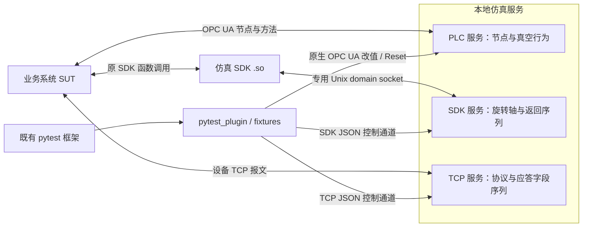

# SimulatorX 本地仿真框架 PRD

本文定义当前 PLC、SDK、TCP 三类仿真服务的需求、接口和实现基线，供开发、测试及接入项目共同使用。快速运行步骤见 [README](../README.md)。

阅读导航：[总体架构](#architecture) · [PLC](#plc) · [SDK](#sdk) · [TCP](#tcp) · [序列规则](#sequences) · [pytest 接入](#pytest) · [运行配置](#running) · [验收](#validation) · [适配边界](#adapters) · [接口附录](#abi)

<a id="goals"></a>

## 1. 目标与交付边界

通过本地软件服务提供可控的设备状态、运动行为和协议应答，帮助既有自动化框架验证业务系统的正常流程及异常处理。SUT 指被测业务系统，其业务操作、报警与恢复判定、进程生命周期由接入项目负责。

| 子系统 | 当前交付 | 主要控制方式 |
|---|---|---|
| PLC | 单真空腔室、八个 OPC UA 原生可写节点、基础真空行为和 Reset | 原生写值、质量码、时间戳与方法调用 |
| SDK | 单个有限行程旋转轴、参考 Linux `.so`、函数返回值序列及模型故障 | 专用 IPC 调用；测试控制接口配置返回值、卡住和限位 |
| TCP | 独立请求应答服务、示例协议、应答字段序列 | 按完整请求选择字段，由协议编码器生成应答 |
| pytest 接入 | 统一插件、按需服务 fixture、用例级资源与清理 | 依赖实际使用的 fixture，独立启动、Reset 和回收服务 |

运行与测试使用 **Python 3.9.12（64 位）**，运行依赖 `opcua==0.98.13`，测试基线 `pytest==8.4.2`；完整依赖见 [requirements.lock](../requirements.lock)。框架从 `src` 源码运行。完整 SDK 服务与 `.so` 验证在 Linux／WSL 中进行；TCP 和纯运动模型也可在 Windows 运行。

默认每类服务单实例、测试串行执行；TCP／OPC UA 监听 `127.0.0.1`，SDK 使用本地 Unix domain socket。并行 CI 作业应各自运行独立实例。当前交付验证了参考 SDK ABI 和示例 TCP 协议，真实厂商适配条件见[第 10 节](#adapters)。

<a id="architecture"></a>

## 2. 总体架构与职责



三类服务分别维护模型、序列、连接和生命周期。测试可以同时使用它们，Reset 或停止任意一个不影响另外两个；当前没有三类设备共享的物理状态模型。

SDK 的 `.so` 在业务进程内负责接口适配，外部 SDK 服务负责行为计算。SDK 服务提供两个不同的 Unix socket：`sdk_socket` 接收 `.so` 的二进制调用，`control_socket` 接收测试侧 JSON 配置与查询。TCP 服务另设业务端口和 JSON 控制端口，其业务应答不经过 SDK 服务。

PLC 节点保存唯一业务状态，每轮行为从当前节点值推进，原生请求、行为更新与 Reset 由同一锁同步。SDK 命令、查询和时间更新在同一状态锁内同步；TCP 按完整请求原子选择应答字段。公共代码只复用通信、序列和进程辅助能力，各服务的状态实例互不共享。

<a id="plc"></a>

## 3. PLC 节点与真空行为

### 3.1 节点契约

Namespace URI 为 `urn:simulatorx:mvp:vacuum`，对象路径为 `Objects/SimulatorX/VacuumChamber1`。客户端按 URI 查询实际命名空间索引，不依赖固定的 `ns` 数字。

| 逻辑节点 | OPC UA 类型 | Reset 初值 | 定义 |
|---|---|---|---|
| `vacuum.valve_command` | UInt16 | 0 | 0 无命令、1 开阀、2 关阀 |
| `vacuum.valve_open` | Boolean | false | 破真空阀反馈 |
| `vacuum.valve_result` | UInt16 | 0 | 0 空闲、1 执行中、2 成功、3 失败 |
| `vacuum.command` | UInt16 | 0 | 0 无命令、1 抽真空、2 破真空、3 停止并关阀 |
| `vacuum.pressure_pa` | Double | 101325 | 当前压力，单位 Pa |
| `vacuum.state_code` | UInt16 | 0 | 0 空闲、1 抽气、2 破真空、3 真空达标、4 故障 |
| `vacuum.result_code` | UInt16 | 0 | 真空操作结果，编码同 `valve_result` |
| `vacuum.alarm_code` | UInt16 | 0 | 0 无报警、1 抽气与开阀冲突、2 非法命令 |

八个变量均为可读写标量。[NodeSet XML](../src/local_service/plc/resources/vacuum.xml) 定义节点层级、类型、权限和导入初值；[bindings.json](../src/local_service/plc/resources/bindings.json) 定义逻辑映射、校验信息与 Reset 基线。二者需人工同步，单独修改 JSON 不会创建节点；启动和 Reset 最终采用绑定的 `baseline`。

### 3.2 基础行为

| 动作或条件 | 阀门反馈与结果 | 真空状态、结果与报警 |
|---|---|---|
| 开阀或关阀 | 反馈对应变化，结果 1 → 2 | 独立操作不改真空结果；抽气中开阀触发联锁 |
| 阀门命令非法 | 反馈保持，阀门结果 3 | 报警 2 |
| 关阀时抽真空 | 阀门保持 | 状态 1、结果 1、报警 0 |
| 开阀时请求抽气或抽气中开阀 | 阀门可执行成功 | 状态 4、结果 3、报警 1 |
| 破真空 | 先退出抽气再开阀 | 状态 2、结果 1、报警 0 |
| 抽气达标 | 保持关闭 | 状态 3、结果 2 |
| 破真空达到常压 | 保持打开 | 状态 0、结果 2 |
| 停止并关阀 | 关闭、阀门结果 2 | 状态 0、结果 0，报警保持 |
| 真空命令非法 | 反馈保持 | 状态 4、结果 3、报警 2 |

处理命令后归零，确认归零后可重复提交；归零前的新写入可能替换尚未处理的命令。阀门立即反馈，客户端可能看不到短暂的执行中状态。有效抽气／破真空命令和 Reset 清除报警。

默认每 100 ms 按经过的时间计算压力：

```text
P_next = P_current × exp(-dt / tau) + P_target × (1 - exp(-dt / tau))
```

开阀趋向 101325 Pa，关阀抽气趋向 1000 Pa；其他状态保持压力，完成容差为 20 Pa。普通抽气／破真空时间常数为 3 s／1.5 s，`--fast` 与默认 pytest 服务为 0.2 s／0.15 s。配置可调整 `pump_tau`、`vent_tau`、`target_pressure`、`tolerance`、`tick_interval`。

自动行为持续运行，下一轮从测试写入后的当前压力继续计算。压力质量非 Good、值为 Null、NaN 或无穷时跳过压力计算并保留 DataValue，同时继续处理命令与 Reset；无可计算压力时不能判定完成。状态、结果与报警随业务动作或转换更新，静态节点不要求持续刷新时间戳。

### 3.3 原生故障注入与 Reset

使用 `opcua.Node.set_value(value, VariantType)` 写值，或传入 `ua.DataValue` 写质量码和源／服务器时间戳。UInt16 接受 0–65535，Double 接受负值和非有限值，Null Variant 表示空值。错误类型返回 `BadTypeMismatch` 并保留原节点值。

`get_value()`／`get_data_value()` 遇到 Bad 质量会抛异常；检查完整异常 DataValue 时使用 `get_attributes([Value])` 或原生 Read 请求。PLC 不使用 SDK/TCP 的返回序列机制，持续异常由测试按场景重复写入。多次请求按实际时序生效，不承诺跨请求的多节点事务或持续覆盖。

`VacuumChamber1.Reset` 是同一命名空间的原生方法，无输入，成功返回 Boolean true。它恢复绑定基线、Good 质量、源／服务器时间戳及运行计时，同时保留连接和订阅。Reset 前需停止业务系统和后台写入者；方法不会阻止其他客户端随后再次改值。恢复失败后环境不可复用，需要重启。

节点写入成功只表示条件已设置。异常值本身不会自动完成业务系统的异常判定，测试仍需调用并观察 SUT 的报警、流程或恢复结果。

<a id="sdk"></a>

## 4. SDK 旋转轴行为与故障控制

### 4.1 模型参数与时间推进

参考 SDK 仅包含轴号 `1`，使用角度、角速度和角加速度，配置有限上下界，不进行 360° 取模或最短路径选择。

| 配置项 | 默认值 | 单位 |
|---|---|---|
| `minimum` / `maximum` | -180 / 180 | ° |
| `initial` / `home` | 0 / 0 | ° |
| `max_speed` | 90 | °/s |
| `acceleration` / `deceleration` | 180 / 180 | °/s² |
| `tick_interval` | 0.01 | s |

通过 JSON 配置模型，校验有限数值、合法行程、初始／回零位置及正速度、加减速度和更新周期。运动使用梯形速度轨迹，短行程使用三角形轨迹；服务按统一单调时间在后台更新，查询频率不决定运动进度。

上述参数是测试默认值。更新周期不是硬实时保证，模型不承诺真实轴的伺服动态、摩擦、回差或定位误差。

### 4.2 正常运动与完成反馈

| 操作或条件 | 行为 |
|---|---|
| 初始化／测试 Reset | 初始角度，未使能、未回零，`busy=false`、`done=false` |
| Enable | 在未触发限位且无锁存报警时使能 |
| Home | 使能后允许回零；完成后设置 `homed=true` |
| MoveAbsolute / MoveRelative | 回零后允许绝对／相对定位；速度必须在允许范围内 |
| 命令返回成功 | 表示命令已接受，运动异步推进；只有到位且速度归零才报告 `done=true` |
| 零距离运动 | 可以立即完成 |
| 忙碌期间的新定位／回零 | 拒绝新命令，保留已有运动 |
| 越界目标 | 直接拒绝，不启动运动；合法运动不越过配置行程 |
| 运动中的 Stop | 以配置减速度停止并取消原目标，完成后 `busy=false`、`done=false`；零速度时直接取消 |
| 空闲时的 Stop | 成功返回，保留已有空闲状态及完成标志 |
| Disable | 立即结束运动、清除使能和回零状态；不清除已注入故障或锁存报警 |

### 4.3 模型故障与恢复

| 故障／操作 | 注入后行为 | 恢复规则 |
|---|---|---|
| `stalled=true` | 定位／回零时冻结当前位置、速度归零，保留目标和 `busy` | 撤销后从当前位置重新规划，不补走冻结期间位移；Stop 可取消目标 |
| 停止过程遇到卡住 | 取消停止目标并结束忙碌状态 | 不继续原定位运动 |
| `positive_limit=true` | 立即停止、取消目标、锁存报警 1 | 先撤销限位，再 ClearFault，之后才能重新接受运动 |
| `negative_limit=true` | 立即停止、取消目标、锁存报警 2 | 先撤销限位，再 ClearFault，之后才能重新接受运动 |
| ClearFault | 所有限位注入均撤销后允许清除报警 | 保留当前位置及回零状态，不恢复已取消的目标；卡住标志需单独撤销 |
| 测试 Reset | 恢复初始角度、未使能和未回零，清除运动与模型故障 | 同时清空该 SDK 服务的序列、游标、调用计数和事件 |

### 4.4 `.so` 与 SDK 服务的接口边界

业务系统调用参考 `.so`，库向 SDK 服务传递函数标识、轴号、角度和速度，取得返回值与状态后写回本进程的输出缓冲区。跨进程只传递数据值，服务不解引用业务进程指针。输出参数只在成功时写入，失败时保留调用方原内容；调用方负责提供有效缓冲区。

每次参考 ABI 调用新建一个本地连接，执行一次请求应答后关闭。整个交换由单调时钟约束超时，处理部分读写、断连和 SIGPIPE；可能已执行的命令不自动重发。通信失败返回 `SX_CONTROL_ERROR` 并记录环境错误，测试应停止复用该环境。IPC 会增加调用耗时，不能用它评估真实 SDK 性能。

参考函数、返回码和二进制格式见[附录 A](#abi)。真实设备需依据厂商头文件、架构、导出符号和生命周期适配，不能直接假定 `SX_*` 与厂商库兼容。

<a id="tcp"></a>

## 5. 独立 TCP 应答与协议适配

TCP 服务接收完整请求，按命令类型选择下一组应答字段，补齐正常基线后编码发送。关联号与命令来自当前请求，长度和校验和由编码器生成。当前范围为请求应答，不提供主动上报。

每个连接独立缓存输入，解析器识别应用帧边界：不足一帧继续接收，一次到达多帧时依次解析。解析或命令校验拒绝的请求会记录协议错误并关闭该业务连接，不消费应答序列，也不因此使整个服务失效。协议校验使用 `ValueError` 表示无效数据；其他未处理的适配器异常（如返回非法消费长度）会标记服务故障，并作为环境错误处理。

正常配置仅覆盖协议字段，不提供原始坏字节注入；长度、CRC、关联号等不能作为应答字段覆盖。序列耗尽恢复正常基线，重连保留消费进度。TCP Reset 清空序列与事件、关闭已有业务连接，并使此前连接的未完成报文失效。

适配器实现 [Protocol](../src/local_service/tcp/protocol.py)，提供无参数工厂，通过 `--protocol module:factory` 或 pytest 的 `--tcp-protocol` 加载。模块路径需可导入，例如加入 `PYTHONPATH`。

| 接口 | 契约 |
|---|---|
| `decode_request(buffer)` | 完整帧返回 `(Request, consumed_bytes)`；不足一帧返回 `None` |
| `baseline(command)` | 返回新的正常字段字典；拒绝未知命令 |
| `validate_fields(command, fields)` | 校验完整字段的编码类型和范围，允许协议可表示的异常业务值 |
| `encode_response(request, fields)` | 依据当前请求和字段生成关联信息、长度、校验和及完整应答 |

`Request` 包含 `command`、`request_id`、`fields`。协议实例不保存连接私有状态，连接缓冲区由服务处理器维护。内置 `DemoProtocol` 的命令与帧格式见[附录 B](#protocol)。其 `READ_ANGLE` 是独立的可配置协议字段，与 SDK 旋转轴没有共享状态。

<a id="sequences"></a>

## 6. 返回值与应答序列

以下是测试侧配置片段，业务异常是否被正确处理仍需通过 SUT 断言：

```python
sdk_returns["rotary.MoveAbsolute"].set_sequence([4, 4])
sdk_axis.set_fault("stalled", True)
state = sdk_axis.snapshot()
sdk_axis.set_fault("stalled", False)

tcp_responses["READ_STATUS"].set_sequence([
    {"status": 7, "ready": False},
    {"status": 8},
])
```

| 规则 | SDK | TCP |
|---|---|---|
| 消费目标 | 按 SDK＋函数独立消费；当前只接受附录 A 的 `rotary.*` | 按协议命令类型独立消费 |
| 每次消费 | 被服务识别的函数调用选择一个返回码 | 每个完整合法请求原子选择一整组字段 |
| 未配置／空序列／耗尽 | 返回值和输出参数依据当前模型状态产生 | 恢复该命令的正常字段基线 |
| 异常配置 | 非零返回码在执行前拒绝该调用，不替换已有运动；已有运动仍随时间推进 | 用配置字段覆盖本次基线，不继承上一项的字段 |
| 正常配置 | 0 不能绕过模型的参数、状态与行程校验 | 未指定字段由本次正常基线补齐 |
| 配置长度与类型 | 最多 10000 个 int32，排除保留值 `INT32_MIN` | 最多 10000 组已知字段，需通过协议类型及编码校验 |

重新配置替换该目标的序列，`cursor` 从 0 开始，`generation` 增加，累计 `calls` 保留至 Reset；已经选出的结果不追溯修改。非法配置不替换原有效序列。并发请求按服务处理顺序消费，记录选择结果，不保证业务系统已收到或处理。

测试侧配置、`snapshot()`、序列查询和诊断查询不消费 SDK 返回序列。业务通过 `.so` 调用 `GetPosition/GetState`，以及测试显式使用 `SDKClient.call()`，属于函数调用，会消费该函数对应的序列；在 `.so` 本地已拒绝、尚未发到服务的参数错误不会消费服务序列。未知 SDK／函数会被拒绝。

在轴已停于 30° 时，位置查询序列耗尽后仍反映 30°。上例 TCP 的第二项结果为 `status=8, ready=true`，第三次恢复为 `status=0, ready=true`。可通过序列 `snapshot()` 查询 `generation`、`cursor`、`remaining`、`calls`，通过事件记录核对消费过程。

<a id="pytest"></a>

## 7. pytest 接入、独立生命周期与诊断

### 7.1 注册与 fixture 契约

本仓库的 pytest 配置已包含 `pythonpath = ["src"]`。外部测试项目需将本仓库 `src` 的绝对路径加入自己的 pytest `pythonpath` 或环境变量 `PYTHONPATH`，随后在公共 `conftest.py` 中注册：

```python
pytest_plugins = ["pytest_plugin"]
```

| Fixture | 作用域 | 返回对象与职责 |
|---|---|---|
| `plc_service` | session | OPC UA endpoint；默认自建 fast 服务，或复用外部 endpoint |
| `plc_client` | function | 原生 `opcua.Client`；建立连接并在结束时断开 |
| `plc_nodes` | function | 逻辑名称到原生 Node 的映射；用例前后 Reset |
| `sdk_service` | session | SDK 控制客户端；自建或复用外部服务 |
| `sdk_axis` | function | SDK 状态查询、故障控制；用例前后 Reset |
| `sdk_returns` | function | SDK 函数返回序列；与 `sdk_axis` 共用一次准备和清理 |
| `sdk_library` | session | 参考 `.so` 文件路径，或指定的已适配库；本身不启动服务 |
| `tcp_service` | session | TCP 控制客户端；`.endpoint` 是业务连接地址 |
| `tcp_responses` | function | 应答字段序列；用例前后 Reset |

加载插件只注册功能，依赖某类 fixture 才启用对应服务。`*_service` 本身不触发逐用例 Reset；用例隔离需依赖资源 fixture。插件只停止自己创建的服务，外部服务由调用方启停；没有统一供用例手动调用 `start()/stop()/reset()` 的服务对象。

SUT 的 fixture 由接入框架提供，并依赖实际使用的 `plc_nodes`、`sdk_axis`／`sdk_returns`、`tcp_responses`。将 `sdk_axis.launch_environment` 合并到业务进程环境，将 `sdk_library` 和 `tcp_service.endpoint` 交给业务系统的真实加载／连接配置。库编译本身不会配置业务系统。

### 7.2 Reset 与清理差异

| 项目 | PLC | SDK | TCP |
|---|---|---|---|
| Reset 恢复内容 | 节点基线、Good、时间戳和行为计时 | 初始轴状态、模型故障、返回序列、计数和事件 | 应答序列、计数和事件 |
| 业务连接 | 保留 OPC UA 连接与订阅 | 每次参考 ABI 调用本就使用独立短连接；服务监听仍在 | 关闭现有业务连接，丢弃其未完成请求；下次需重连 |
| 用例级诊断 | 无 SDK/TCP 同结构的自动 JSON 导出；通过原生节点读取、JUnit 和控制台定位 | 自动保存轴状态、序列、事件、原生错误及自建服务日志 | 自动保存序列、事件及自建服务日志 |
| 用例清理顺序 | 停止 SUT／后台任务 → Reset → 断开测试客户端 | 停止 SUT／后台任务 → 诊断 → 健康检查 → Reset | 停止 SUT／后台任务 → 诊断 → 健康检查 → Reset |

自建服务在 pytest 会话结束时停止。资源 fixture 在初次 Reset 前注册最终清理，准备失败或断言失败后仍尝试恢复；SDK/TCP 即使诊断阶段失败，也继续尝试健康检查和 Reset。Reset、相关断连或 SDK/TCP 诊断／健康检查失败会记录 pytest 错误，并中止后续用例。

后台任务和 SUT 的停止／等待回调必须由其 fixture 登记，利用依赖顺序确保写入者先退出。若 SUT 停止失败、pytest 被强制结束或环境不可恢复，接入方应终止本轮、回收写入者后再恢复环境。

### 7.3 诊断与错误分类

SDK/TCP 默认把用例诊断写入 `artifacts/simulatorx/`，可用 `--simulatorx-artifacts` 修改；包含用例标识、序列进度、最近最多 2000 条事件及相应状态和日志。JUnit 记录断言结果、耗时和准备／清理错误，流水线需保留退出码并在失败时归档报告与日志。

注入的 SDK 返回码和 TCP 异常字段属于测试条件；业务处理符合预期时用例可通过。服务不可用、SDK 专用 IPC 超时或断连、诊断／清理失败属于环境错误。参考 `.so` 的错误标记不能通过普通模型 Reset 擦除，需停止复用并重新建立可用环境。

`SDKClient.call()` 可用于检查模型服务，验证业务集成必须实际加载 `.so`。仓库的 [native_client.c](../tests/local_service/sdk/native_client.c) 是通过参考 C ABI 访问模型的独立测试进程。

<a id="running"></a>

## 8. 源码运行、配置与服务管理

### 8.1 目录与环境

```text
src/
├── main.py                 # 指定 plc、sdk、tcp 或 build-sdk
├── pytest_plugin.py        # 统一插件入口
├── local_service/
│   ├── common/             # 通信、序列、控制客户端和源码路径辅助
│   ├── plc/                # 服务、模型、绑定、资源与进程管理
│   ├── sdk/                # 服务、模型、客户端、构建和 native 源码
│   ├── tcp/                # 服务、协议和客户端
│   └── process.py          # SDK/TCP 子进程管理
└── testing/                # common、plc、sdk、tcp fixture 实现
tests/
├── local_service/          # 三类服务的行为与协议测试
└── testing/                # 插件隔离、外部服务与异常清理测试
```

`src` 是源码搜索根，导入使用 `local_service.*`、`testing.*` 和 `pytest_plugin`。服务实现不依赖 pytest，XML／JSON 和 C 源码按所属模块位置加载。子进程获得绝对 `src` 搜索路径，并保留已有 `PYTHONPATH`，不依赖框架安装或当前工作目录。

在项目根目录、已激活的 Python 3.9.12 环境中安装依赖并启动所需组件：

```sh
python --version
python -m pip install -r requirements.lock
python src/main.py plc --opcua-port 4840 --fast
```

命令只启动指定服务。PLC 默认地址为 `opc.tcp://127.0.0.1:4840/simulatorx/`；指定端口 0 由操作系统分配，端口冲突时报错并保留原占用者。启动脚本可使用绝对路径；显式传入的配置与输出相对路径仍相对于调用时的工作目录。

### 8.2 SDK 构建、启动与业务进程配置

以下命令在 Linux／WSL 项目根目录执行，需要 C 编译器：

```sh
python src/main.py build-sdk --output artifacts/native
```

输出 `artifacts/native/libsimulatorx_sdk.so`。也可使用 CMake：

```sh
cmake -S src/local_service/sdk/native -B artifacts/native-cmake
cmake --build artifacts/native-cmake
```

每次独立启动 SDK 使用新的临时目录，避免复用其他运行的 socket 或错误文件：

```sh
sdk_run_dir=$(mktemp -d /tmp/sx-sdk.XXXXXX)
python src/main.py sdk \
  --control-socket "$sdk_run_dir/control.sock" \
  --sdk-socket "$sdk_run_dir/sdk.sock" \
  --error-file "$sdk_run_dir/native.errors"
```

服务启动后输出实际地址。测试连接 `control_socket`；业务进程加载 `.so` 时使用以下环境变量：

| 环境变量 | 内容 |
|---|---|
| `SIMULATORX_CONTROL_SOCKET` | SDK 服务输出的 **`sdk_socket`** 路径，即二进制调用通道 |
| `SIMULATORX_SDK_ERROR_FILE` | 本轮服务的 `error_file`，与测试检查的文件一致 |
| `SIMULATORX_CONTROL_TIMEOUT_MS` | 整次 ABI 交换超时；默认 1000 ms，允许 1–60000 ms |

业务进程与测试进程需能够访问这些路径；跨容器时需共享相应路径。环境变量不替代原库加载配置，接入方还需通过实际库路径或隔离运行目录保证业务系统加载正确的仿真 `.so`。

### 8.3 TCP 启动与命令行参数

```sh
python src/main.py tcp --port 0 --control-port 0
```

输出 `endpoint` 为业务连接地址，`control_endpoint` 为测试控制地址；两个端口独立分配并只监听本机。

| 入口 | 参数与规则 |
|---|---|
| PLC | `--opcua-port` 默认 4840；`--nodeset` 可重复并按依赖顺序导入；`--bindings` 指定映射；`--profile` 指定行为配置；`--fast` 使用快速配置，同时指定 profile 时以显式 profile 为准 |
| SDK | `--control-socket`、`--sdk-socket` 必填且不同；`--error-file` 默认取 SDK socket 路径加 `.errors`；`--profile` 为旋转轴 JSON 配置 |
| TCP | `--port`、`--control-port` 默认均为 0；`--protocol module:factory` 默认使用 DemoProtocol |
| 三类服务 | `--ready-file` 输出就绪信息；`--managed` 在父进程 stdin 收到一行或 EOF 后退出；独立运行时 Ctrl+C 退出 |
| build-sdk | `--output` 必填；`--compiler` 可指定 C 编译器，默认查找 cc／gcc |

进程管理器等待服务就绪并执行连接／健康检查后返回，只回收自己创建的进程、端口和 socket 资源。服务状态与来源不同，PLC 使用独立进程管理器，SDK/TCP 复用进程管理辅助。

### 8.4 pytest 参数

| 参数 | 用途与限制 |
|---|---|
| `--opcua-endpoint` | 复用已有 PLC 服务；省略则自建 fast 服务并分配端口 |
| `--sdk-control` | 复用已有 SDK 服务的 JSON 控制 socket |
| `--sdk-profile` | 配置自建 SDK 服务；外部 SDK 配置须在服务启动时设置，不与 `--sdk-control` 同用 |
| `--sdk-library` | 使用指定的现有 `.so`，省略则由 `sdk_library` 编译参考库 |
| `--tcp-control` | 复用已有 TCP 控制端点，格式 `host:port` |
| `--tcp-protocol` | 配置自建 TCP 服务的协议工厂；外部协议须在服务启动时设置，不与 `--tcp-control` 同用 |
| `--simulatorx-artifacts` | SDK/TCP 用例诊断目录，默认 `artifacts/simulatorx` |

<a id="validation"></a>

## 9. 验收矩阵与已有验证记录

| 验证内容 | 主要测试来源 |
|---|---|
| PLC 行为、联锁、非法命令、单一压力来源和配置校验 | [test_simulator.py](../tests/local_service/plc/test_simulator.py) |
| PLC 计时、Reset 失败与行为线程异常 | [test_lifecycle.py](../tests/local_service/plc/test_lifecycle.py) |
| 原生读写、类型、DataValue、连接订阅与端口生命周期 | [test_integration.py](../tests/local_service/plc/test_integration.py) |
| 旋转轴正反向、短行程、回零、停止、越界、忙碌拒绝、不同时间步长一致性及故障恢复 | [test_motion.py](../tests/local_service/sdk/test_motion.py) |
| SDK 序列独立消费、耗尽、替换、Reset、并发调用及无轮询时的后台推进 | [test_sdk_service.py](../tests/local_service/sdk/test_sdk_service.py) |
| 独立业务测试进程实际加载 `.so`，参数与输出写回、故障反馈、IPC 失败及不重发 | [test_native_sdk.py](../tests/local_service/sdk/test_native_sdk.py) |
| TCP 长度／CRC、分段与多帧、字段原子消费、重连、Reset 及替换协议 | [test_tcp_service.py](../tests/local_service/tcp/test_tcp_service.py) |
| 准备／断言失败清理、后台任务停止顺序、清理失败中止 | [PLC fixture 测试](../tests/testing/test_plc_fixtures.py)、[SDK/TCP fixture 测试](../tests/testing/test_service_fixtures.py) |
| 三类服务按需启用、独立停止／Reset、外部服务所有权、SDK 资源共享一次 Reset | [test_independent_services.py](../tests/testing/test_independent_services.py) |
| 仓库外源码启动、子进程搜索路径、自定义协议加载与源码构建 `.so` | [test_source_entrypoint.py](../tests/test_source_entrypoint.py) |

最近一次本地代码基线验证记录：**2026-09-07，Linux／WSL、Python 3.9.12，仅安装锁定依赖而未安装本框架，104 项测试通过，0 失败、0 错误、0 跳过。** 此记录覆盖框架和参考接口，不代表真实设备或厂商业务集成已经验收。

后续功能变更可在同类环境中执行：

```sh
python -m pytest -q --junitxml=artifacts/junit.xml
```

非 Linux 环境会跳过 Linux SDK 集成用例，不能据此声称 `.so` 已验证。保留 JUnit 与控制台日志；虚拟环境、编译输出和运行诊断不纳入源码提交。

<a id="adapters"></a>

## 10. 真实接入与扩展边界

| 接入方向 | 必要材料及实施要求 |
|---|---|
| PLC 新节点／新设备 | 同步 XML 与绑定，补充所需行为；当前模型要求八个真空节点和 VacuumChamber1 对象。服务自定义绑定不会自动传入现有 fixture，测试侧需同步映射 |
| 厂商 SDK | 原库与头文件、实际调用清单、返回码与失败时输出参数约定、角度／脉冲单位换算、初始化和句柄生命周期；按目标架构、函数签名、导出符号与必要符号版本构建适配库 |
| 设备 TCP | 协议定义、请求应答样例、帧边界、关联方式、字段类型、编码及校验算法；实现 Protocol 并验证正常及异常字段应答 |
| 业务测试框架 | 库加载路径、TCP 地址、SUT 启停方式、可观察业务结果及清理回调；据此编写真实流程的故障用例 |

当前范围是一个真空腔室、一个参考旋转轴和一个示例 TCP 协议。尚不包含跨组件物理耦合、多轴协调、真实伺服动态与定位误差、硬实时或性能一致性保证，也不提供面向任意厂商的通用二进制替换。TCP 范围为应答字段控制，不扩展为主动遥测或原始坏报文注入。

后续扩展应先补齐目标设备材料与 SUT 接入方式，再增加相应模型／适配器和验收用例。框架准备好的异常条件与业务系统正确处理异常是两项不同的验收事实，需分别提供证据。

<a id="abi"></a>

## 附录 A：参考 SDK ABI 与专用调用编码

参考头文件为 [simulatorx_sdk.h](../src/local_service/sdk/native/simulatorx_sdk.h)，实现为 [simulatorx_sdk.c](../src/local_service/sdk/native/simulatorx_sdk.c)。所有函数返回 `int32_t`，轴号类型为 `int32_t`，参考轴号为 1。

| 操作编号 | C 函数 | 序列目标 | 参数／输出 |
|---|---|---|---|
| 1 | `SX_Enable` | `rotary.Enable` | 轴号 |
| 2 | `SX_Disable` | `rotary.Disable` | 轴号 |
| 3 | `SX_Home` | `rotary.Home` | 轴号、回零速度（double） |
| 4 | `SX_MoveAbsolute` | `rotary.MoveAbsolute` | 轴号、目标角度（double）、速度（double） |
| 5 | `SX_MoveRelative` | `rotary.MoveRelative` | 轴号、角度增量（double）、速度（double） |
| 6 | `SX_Stop` | `rotary.Stop` | 轴号 |
| 7 | `SX_ClearFault` | `rotary.ClearFault` | 轴号 |
| 8 | `SX_GetPosition` | `rotary.GetPosition` | 轴号；写回 `double *position_deg` |
| 9 | `SX_GetState` | `rotary.GetState` | 轴号；写回 `SX_State *state` |

| 返回码 | 定义 |
|---|---|
| 0 | `SX_OK`，成功 |
| 1 | `SX_INVALID_ARGUMENT`，参数错误 |
| 2 | `SX_NOT_ENABLED`，未使能 |
| 3 | `SX_NOT_HOMED`，未回零 |
| 4 | `SX_BUSY`，忙碌 |
| 5 | `SX_LIMIT`，限位／目标越界 |
| 6 | `SX_FAULT`，锁存故障 |
| 7 | `SX_UNKNOWN_FUNCTION`，未知函数的码值定义 |
| `INT32_MIN` | `SX_CONTROL_ERROR`，保留给控制通信错误，禁止配置为注入值 |

`SX_State` 包含三个 double：`position_deg`、`velocity_deg_s`、`target_deg`；六个 uint32：`enabled`、`homed`、`busy`、`done`、`alarm`、`faults`。参考构建校验该结构大小为 48 字节。`faults` 的 bit 0／1／2 分别表示卡住、正限位、负限位。

专用 socket 的请求／应答使用固定网络字节序，所有浮点数为 binary64：

| 报文 | 总长度 | 按顺序排列的字段 |
|---|---|---|
| 请求 | 28 字节 | `SX01`（4 字节）、uint32 操作编号、int32 轴号、两个 binary64 参数 |
| 应答 | 56 字节 | `SX01`（4 字节）、int32 返回值、三个 binary64（位置／速度／目标）、六个 uint32（enabled／homed／busy／done／alarm／faults） |

Home 使用第一个浮点参数作为速度；Move 使用角度与速度，其余调用使用零占位。指针和 C 结构体的原始内存布局不进入通信报文，`.so` 接收后逐字段转换并按接口约定写回业务进程。

<a id="protocol"></a>

## 附录 B：示例 TCP 协议与控制通道

`DemoProtocol` 使用下列帧结构：

```text
uint32 大端 payload 长度 + UTF-8 JSON payload + uint32 大端 CRC32(payload)
```

payload 长度必须为 1–65536 字节。JSON 对象包含且仅包含 `kind`、`command`、`request_id`、`fields`；`request_id` 为 uint32。请求的 `kind` 为 `request`、`fields` 为空对象，应答的 `kind` 为 `response`，命令和关联号沿用当前请求。

| 命令 | 正常应答字段 | 字段类型 |
|---|---|---|
| `READ_STATUS` | `status: 0, ready: true` | status 为 int32，ready 为 Boolean |
| `READ_ANGLE` | `status: 0, angle_deg: 0.0` | status 为 int32，angle_deg 为有限数值 |

接入实际设备时替换协议适配器，不能直接把该示例帧格式视为厂商协议。SDK 的二进制调用、设备 TCP 帧以及测试管理 JSON 是三种不同的通信约定。

SDK 与 TCP 的测试控制通道复用按换行分隔的 JSON 请求应答，每次控制连接处理一次交换；SDK 通过独立 Unix socket，TCP 通过独立控制端口。控制客户端默认超时为 2 s，单条 JSON 报文上限为 8 MiB；正常应答包含 `ok` 与 `result`，错误应答包含 `ok=false`、错误信息，以及环境错误时的 `environment_error` 标志。测试侧通过现有客户端和 fixture 使用这些控制接口。
