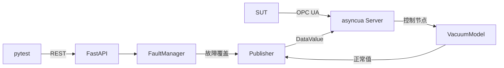

# SimulatorX MVP：OPC UA PLC 仿真与故障注入技术方案

## 1. 目标

MVP 启动一个可被 SUT 连接的 OPC UA PLC 仿真服务，并让测试人员通过 REST API 在 Setup 中注入节点故障、在 Teardown 中清除故障。

测试流程固定为：

1. 启动仿真并等待 `/healthz` Ready。
2. Setup 调用 Reset，再注入真空度或 PLC 状态故障。
3. SUT 通过 OPC UA Read/Subscribe 观察异常，测试验证中断、报警或弹窗行为。
4. Teardown 清除故障并再次 Reset，下一条用例从确定基线开始。

本方案仅包含一个 Python 进程、一个 OPC UA Server、一个 REST 控制服务、一个真空腔模型、三种节点故障和 pytest 使用接口。

## 2. 技术架构

- Python 3.11。
- `asyncua` 实现 OPC UA Server、节点、订阅和 `DataValue`。
- FastAPI lifespan 启停 OPC UA Server 和模型任务，Uvicorn 提供 REST 服务。
- `httpx` 封装测试客户端，pytest 提供用例 fixture。



- 整个服务运行在一个 asyncio 事件循环中；Uvicorn 固定为 `workers=1`、`reload=False`。
- FastAPI lifespan 依次创建节点、启动 OPC UA Server 和 100 ms 模型任务。任一步失败，服务启动失败。
- `VacuumModel` 保存无故障真实值；`FaultManager` 保存活动故障；`Publisher` 生成对外 `DataValue`。
- 模型 Tick、故障应用、故障清除和 Reset 共用一个 `asyncio.Lock`。
- 故障不修改模型真实值；清除后发布模型当前值，Reset 才恢复初始值。
- REST 成功响应保证 OPC UA 服务端已经完成写入并可立即读取；测试仍需等待 SUT 处理订阅或业务逻辑。
- 节点更新使用 `Node.write_value(DataValue)`，显式设置 Variant 类型、StatusCode 和 UTC SourceTimestamp。
- 进程停止后必须释放 OPC UA 和 REST 端口。

## 3. 真空腔 PLC Demo

### 3.1 OPC UA 地址空间

- 默认 Endpoint：`opc.tcp://127.0.0.1:4840/simulatorx/`
- Namespace URI：`urn:simulatorx:mvp:vacuum`
- 对象路径：`Objects/SimulatorX/VacuumChamber1`

客户端通过 Namespace URI 查询 Namespace Index，不硬编码 `ns=2`。节点使用稳定字符串 NodeId。

| REST 故障目标 | String NodeId | 类型 | 权限 | 基线 |
| --- | --- | --- | --- | --- |
| — | `VacuumChamber1.Control.PumpEnabled` | Boolean | 读写 | `false` |
| — | `VacuumChamber1.Control.VentOpen` | Boolean | 读写 | `false` |
| — | `VacuumChamber1.Control.TargetPressurePa` | Double | 读写 | `1000.0` |
| `vacuum.pressure_pa` | `VacuumChamber1.Status.PressurePa` | Double | 只读 | `101325.0` |
| `vacuum.state_code` | `VacuumChamber1.Status.StateCode` | UInt16 | 只读 | `0` |
| `vacuum.alarm_code` | `VacuumChamber1.Status.AlarmCode` | UInt16 | 只读 | `0` |

MVP 只允许对三个只读状态节点注入故障；三个控制节点由 SUT 通过 OPC UA 写入。

状态码：`0=IDLE`、`1=PUMPING`、`2=VENTING`、`3=AT_TARGET`、`4=FAULT`。

报警码：`0=无报警`、`1=Pump 与 Vent 同时开启`、`2=抽气时目标压力不在 0.1–101325 Pa`。

### 3.2 真空模型

模型使用单调时钟计算 `dt`，目标 Tick 周期为 100 ms：

```text
抽气：P = max(Target, P + (Target - P) × (1 - exp(-dt / 3.0)))
充气：P = P + (101325.0 - P) × (1 - exp(-dt / 1.5))
空闲：P = min(101325.0, P + 5.0 × dt)
容差：Tolerance = max(5.0, Target × 2%)
```

每个 Tick 按下列顺序重新计算状态和报警，不锁存上一 Tick 的结果：

| 优先级 | 条件 | 状态与报警 | 压力行为 |
| --- | --- | --- | --- |
| 1 | Pump 与 Vent 同时开启 | `FAULT`，报警 `1` | 充气 |
| 2 | 仅 Vent 开启 | `VENTING`，报警 `0` | 充气 |
| 3 | 仅 Pump 开启且目标非法 | `FAULT`，报警 `2` | 空闲泄漏 |
| 4 | 仅 Pump 开启且 `P > Target + Tolerance` | `PUMPING`，报警 `0` | 抽气 |
| 5 | 仅 Pump 开启且 `P <= Target + Tolerance` | `AT_TARGET`，报警 `0` | 保持当前压力 |
| 6 | Pump 与 Vent 均关闭 | `IDLE`，报警 `0` | 空闲泄漏 |

PLC 控制节点的写入最晚在下一个 Tick 生效。

## 4. 故障注入

### 4.1 故障类型

| `mode` | 请求参数 | 生效行为 | 清除行为 |
| --- | --- | --- | --- |
| `override` | `value` | 每个 Tick 发布指定值、`Good` 和新时间戳。值必须匹配目标 OPC UA 类型；Double 必须为有限数值，但不校验物理范围。 | 发布模型当前值和 `Good`。 |
| `freeze` | 无 | 捕获当前 `DataValue`，停止写该节点，使 Value、StatusCode 和 SourceTimestamp 保持不变。 | 发布模型当前值和 `Good`。 |
| `bad_quality` | 无 | Publisher 显式发布 `Value=null`、`StatusCode=BadSensorFailure`。 | 发布模型当前值和 `Good`。 |

每个目标最多一个活动故障。故障只影响目标节点，不联动其他状态节点。例如压力异常不会自动修改 `AlarmCode`。

### 4.2 REST API

- 默认 Base URL：`http://127.0.0.1:8000`
- OpenAPI：`/docs`
- CLI 的 `--opcua-port` 和 `--api-port` 可覆盖默认端口。

| 方法与路径 | 语义 |
| --- | --- |
| `GET /healthz` | OPC UA 和模型任务正常时返回 Ready，否则返回 503。 |
| `PUT /api/v1/faults/{fault_id}` | 幂等应用故障。 |
| `DELETE /api/v1/faults/{fault_id}` | 幂等清除故障。 |
| `POST /api/v1/reset` | 清除全部故障并恢复基线。 |

测试端为每次故障指定 fault ID。即使 PUT 响应丢失，Teardown 仍能用同一 ID 清理。

应用压力高值：

```http
PUT /api/v1/faults/test-pressure-high
Content-Type: application/json

{
  "target": "vacuum.pressure_pa",
  "mode": "override",
  "value": 200000.0
}
```

首次创建返回 `201`；所有故障模式的成功体固定为以下结构，`effective.value` 可以是布尔值、数值或 Null：

```json
{
  "fault_id": "test-pressure-high",
  "target": "vacuum.pressure_pa",
  "mode": "override",
  "effective": {"value": 200000.0, "status_code": "Good"}
}
```

接口规则：

- 活动故障使用相同 ID 和相同请求重试时返回 `200` 和相同结果。
- 活动故障使用相同 ID、不同请求时返回 `409 FAULT_ID_REUSED`。
- 同一目标已被其他 ID 占用时返回 `409 TARGET_BUSY`。
- DELETE 对存在或不存在的 ID 均返回 `204`。DELETE 或 Reset 后，该 ID 可重新创建。
- 应用失败时返回 `500 FAULT_APPLY_FAILED`，故障表保持原状。
- 清除失败时返回 `500 FAULT_CLEAR_FAILED`，原故障保持活动。
- Reset 清除故障并恢复六个节点的基线，不重启 OPC UA Server，不断开现有客户端和订阅。
- Reset 中任一节点恢复失败时返回 `500 RESET_FAILED`；调用方必须终止当前测试，不得把部分恢复视为成功。

错误体固定为：

```json
{"error": {"code": "TARGET_BUSY", "message": "Target already has an active fault"}}
```

参数错误返回 422，目标不存在返回 404，冲突返回 409，内部写入失败返回 500，服务未就绪返回 503。

## 5. 测试人员使用方法

### 5.1 启停与直接调用

```powershell
python -m simulatorx --opcua-port 4840 --api-port 8000
```

端口占用时启动失败，不自动切换端口。进程停止后两个端口均可立即重新绑定。

```bash
curl -X PUT http://127.0.0.1:8000/api/v1/faults/test-pressure-high \
  -H "Content-Type: application/json" \
  -d '{"target":"vacuum.pressure_pa","mode":"override","value":200000.0}'

curl -X DELETE \
  http://127.0.0.1:8000/api/v1/faults/test-pressure-high
```

### 5.2 Python/pytest 接口

`SimulatorControl` 只封装 REST，公开以下方法：

- `wait_ready(timeout)`
- `reset()`
- `inject(fault_id, target, mode, *, value=None)`
- `clear(fault_id)`
- `fault(...)` 上下文管理器

```python
import pytest


@pytest.fixture(autouse=True)
def isolated_simulator(simulator_control):
    simulator_control.reset()
    yield
    simulator_control.reset()


def test_pressure_sensor_high(simulator_control, sut):
    with simulator_control.fault(
        fault_id="test-pressure-sensor-high",
        target="vacuum.pressure_pa",
        mode="override",
        value=200000.0,
    ):
        sut.start_process()
        sut.wait_for_pressure_alarm(timeout=3)
        assert sut.pressure_alarm_active
```

上下文管理器在 `finally` 中清除当前故障，fixture 在 Teardown 再执行 Reset。两项操作均幂等。

测试 `bad_quality` 时，使用 `read_data_value(raise_on_bad_status=False)` 或订阅回调检查完整 `DataValue`；服务端发布结果固定为 Null Value 和 `BadSensorFailure`。

## 6. 验收标准

1. `/healthz` Ready 后，真实 OPC UA Client 能浏览全部节点、写入三个控制节点、读取并订阅三个状态节点。
2. 真空模型在所有状态组合下严格遵守优先级表，不出现升压式抽气或状态/报警冲突。
3. `override`、`freeze`、`bad_quality` 的 Value、StatusCode 和 SourceTimestamp 符合定义，清除后恢复模型当前值和 `Good`。
4. REST 成功后 OPC UA 服务端立即可读；测试通过等待 SUT 业务结果完成断言。
5. PUT/DELETE 可安全重试；ID 复用、目标冲突或节点写入失败不破坏已有故障状态。
6. Reset 成功后全部节点恢复基线且连接/订阅保持；Reset 失败返回 500，当前测试停止执行。
7. 测试断言失败时 Teardown 仍清除故障，下一条用例从基线开始。
8. 停止进程后 OPC UA 和 REST 端口均被释放。
