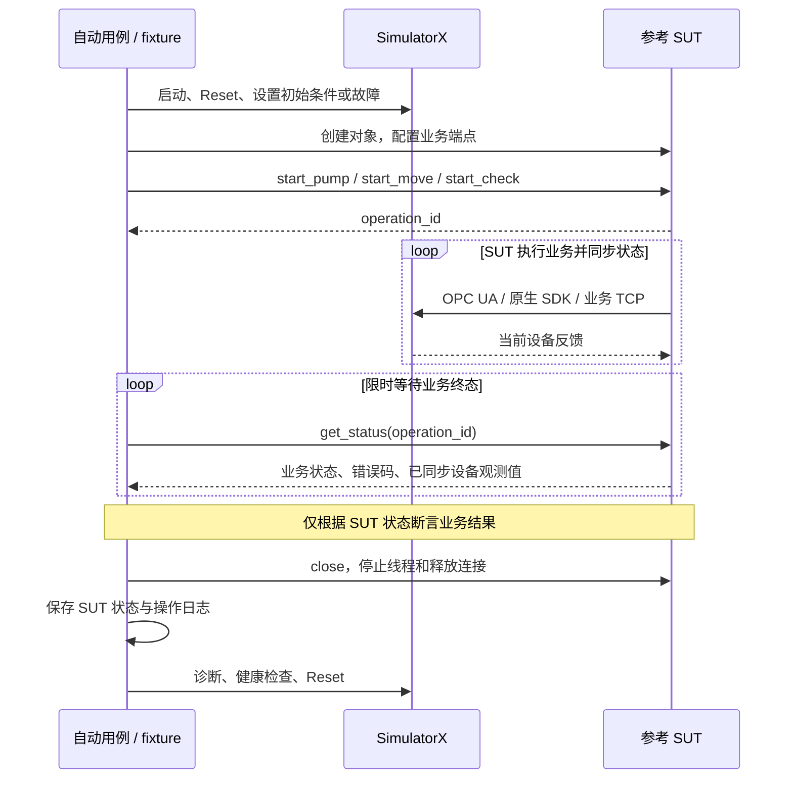

# SUT 业务闭环接入示例

这是 SimulatorX 的**外部使用方示例项目**。`reference_sut/` 是参考业务应用，`tests/` 是接入方测试；两者均不属于仿真框架，不由框架导入、启动或发布。示例使用仓库锁定依赖，不新增运行依赖。

本示例通过整机配置启动三个协议宿主及参考设备。`type` 选择宿主，子系统与硬件 ID 定位 `model.py:create`；清单仅内联运行设置，不填写 factory 或 definition。SUT 从接入层获取节点绑定、TCP 地址和 SDK ABI，无需导入宿主或模型。

## 调用链与职责



三个业务对象与用例处于同一 Python 进程，分别执行独立业务流程，不提供 HTTP 服务或整机编排。每个对象独立建立设备连接。SUT 不访问测试控制通道，不导入模型或控制客户端；它只复用设备节点绑定、TCP 编码定义，并声明头文件中的原生 ABI。

## Python 接口

```python
from reference_sut import VacuumSUT, MotionSUT, DetectorSUT

vacuum = VacuumSUT(opcua_endpoint, pressure_threshold=1020)
operation_id = vacuum.start_pump()
status = vacuum.get_status(operation_id)
vacuum.close()

motion = MotionSUT(library_path, position_tolerance=0.01)  # Windows DLL / Linux .so
operation_id = motion.start_move(target_deg=30, speed_deg_s=90)
motion.close()

detector = DetectorSUT((host, port))  # 业务 TCP 端口
operation_id = detector.start_check()
detector.close()
```

上面展示接口用法；实际用例必须限时等待终态后断言，不能在刚提交命令时判定成功。完整示例见 [业务用例](tests/test_business.py)。通用构造参数为 `timeout=10`、`poll_interval=0.05`、`io_timeout=1`，单位均为秒且必须有限、为正。`VacuumSUT` 可传入配套 `bindings_path`。

`get_status()` 返回独立字典：

```json
{
  "operation_id": "本次操作唯一标识",
  "state": "running",
  "error_code": null,
  "message": null,
  "observed": {},
  "last_synced_at": null
}
```

- `state` 为 `running/succeeded/failed`；`observed` 是 SUT 最后同步的设备反馈，`last_synced_at` 是对应 UTC 时间。开始时尚无观测，字段分别为空对象和 null。
- 查询只读取缓存，不发设备请求，不额外消费注入序列。终态保留最后观测；新操作使用新标识和空观测，旧操作仍可查询。
- 同一对象忙碌时拒绝新操作；未知标识抛 `KeyError`；关闭后不能启动。`close()` 可重复调用，取消并等待线程退出。
- `diagnostics()` 提供全部操作状态和最近 2000 条操作事件，供接入方归档。

| 流程 | 成功条件 | 主要错误码 |
|---|---|---|
| 抽真空 | 当前命令已被处理，状态 3、结果 2、无报警且压力不超过阈值 | `vacuum_alarm`、`bad_quality`、`invalid_pressure` |
| 轴定位 | 使能、回零、定位均完成，最终已回零、done、非 busy、速度归零且位置满足容差 | `sdk_error`、`motion_alarm`、`invalid_position` |
| 探测器检查 | 功能码 04 读取状态为 0、就绪为 1，再读取测量值 | `device_error`、`protocol_error` |

共同错误码包括 `timeout`、`communication_error`、`cancelled`、`internal_error`。命令提交成功不等于业务完成。SDK 查询失败不使用其输出参数；设备断连不返回旧成功状态。流程异常时 PLC 尝试停止抽气，SDK 尝试 Stop，然后释放资源；停止请求失败会报告错误。参考轴回零位置按仓库默认设备契约为 0°，自定义设备需同步修改接入配置/实现。

## fixture 与业务断言

[conftest.py](conftest.py) 注册公共 `pytest_plugin`，仅在本示例内提供场景和 SUT fixture。依赖顺序为 `device → scenario → sut`；`scenario` 完成所有条件准备后才创建 SUT。

```python
import pytest
from integration_support import terminal

@pytest.mark.parametrize("scenario", [("vacuum", "interlock")], indirect=True)
def test_interlock(sut):
    status = terminal(sut, sut.start_pump())
    assert status["state"] == "failed"
    assert status["error_code"] == "vacuum_alarm"
```

这里用例通过，是因为 SUT 正确拒绝了联锁条件下的业务。实际运行的预期场景定义在 fixture 中；不能把 SimulatorX 注入成功或节点值一致当作业务通过的依据。

SDK fixture 在加载库之前合并硬件句柄的 `launch_environment`，在 SUT 关闭后恢复环境变量。其 ABI 环境配置属于进程级配置，所以同一进程内不能同时路由多个 SDK 实例。

[integration_support.py](integration_support.py) 负责测试项目的 SUT 清理与诊断。正常顺序是停止 SUT、保存 SUT 诊断，然后由公共 fixture 保存仿真诊断、健康检查及 Reset。SUT 停止失败时先停止仿真环境，使后续 Reset 被拒绝，并中止剩余测试。不要在运行中的 SUT 外部调用设备 Reset。

SUT 业务断言失败与环境错误分开报告：仿真服务健康检查、诊断或清理失败是 pytest 环境错误，即使预期的业务断言通过，也不能判定整轮成功。

## 运行与验收

在仓库根目录安装 `requirements.lock`，下面命令中的 `python` 应指向该环境。完整验收要求 Python 3.9.12（64 位）；Windows 使用 MinGW-w64 GCC 构建并真实加载 DLL，Linux／WSL 使用 C 编译器构建并加载 `.so`。

```sh
# 示例完整验收：业务闭环 + SUT 自身和清理机制测试
python -m pytest -c examples/sut_integration/pytest.ini examples/sut_integration/tests --simulatorx-artifacts artifacts/sut-example/simulatorx --sut-artifacts artifacts/sut-example/sut --junitxml=artifacts/sut-example/junit.xml -q

# 可选：仅验证 PLC/TCP 子集
python -m pytest -c examples/sut_integration/pytest.ini examples/sut_integration/tests --simulatorx-select vacuum/chamber_plc --simulatorx-select detector/modbus_tcp --simulatorx-artifacts artifacts/sut-example/simulatorx --sut-artifacts artifacts/sut-example/sut --junitxml=artifacts/sut-example/windows.xml -q

# 框架自身回归（独立命令、独立报告）
python -m pytest -q --junitxml=artifacts/framework-junit.xml
```

也可进入本示例目录直接运行 `python -m pytest`；配置中的路径以本示例为基准。根目录执行时显式传入上面的测试目录，以便 pytest 在解析参数时加载示例插件。

`-m business` 仅运行业务闭环；`-m 'not business'` 运行参考 SUT 和接入生命周期测试。框架自身测试仍可直接断言 SimulatorX；示例的 SUT 自身测试可检查协议调用次数，业务闭环用例只断言 SUT 返回的结果。

`-m 'not integration'` 只运行参考 SUT 的内存操作测试；真实网络对端、业务闭环和隔离 pytest 子进程均标记为 `integration`。默认仍执行全部示例用例，快速筛选不代替完整验收。

流水线保留 pytest 原始退出码并始终归档 JUnit、`artifacts/sut-example/sut/` 和 `artifacts/sut-example/simulatorx/`。示例自身测试中的隔离子进程会故意产生失败，以验证清理和中止机制；外层测试验证这些失败符合预期。选择 PLC/TCP 子集不代表完整三协议验收通过。不存在适用于任意流水线平台的自动发布或流水线配置。

## 替换为真实业务服务

保留场景准备 fixture 和“调用业务 → 查询状态 → 断言”的用例结构，替换示例 `sut` fixture：

1. 将 SimulatorX 业务端点或参考 SDK 库路径配置给真实业务服务；框架不负责真实服务的业务状态。
2. 在接入项目内实现适配器，将三个启动操作映射到真实服务的业务接口，将真实请求标识映射为 `operation_id`。
3. 将服务查询/状态接口映射到统一状态结果；状态必须来自真实服务，不得以 SimulatorX 查询补齐或替代。真实服务负责设备同步、业务判定与缓存有效性。
4. 映射停止、等待和诊断操作，确保真实服务及后台写入者在 Reset 前退出。真实服务的传输、鉴权和部署配置归接入项目维护。

示例验证了接入结构和参考业务行为，不证明厂商协议兼容性或真实业务服务已验收。
